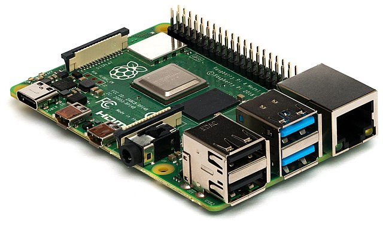
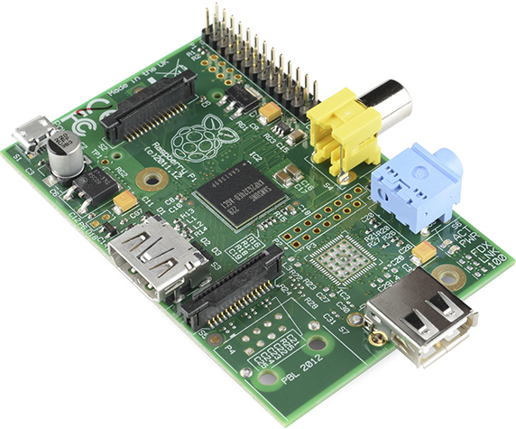
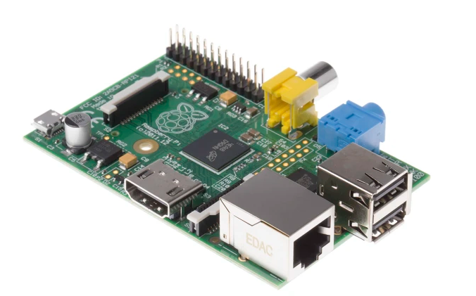
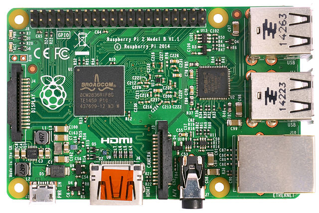
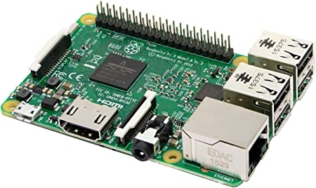
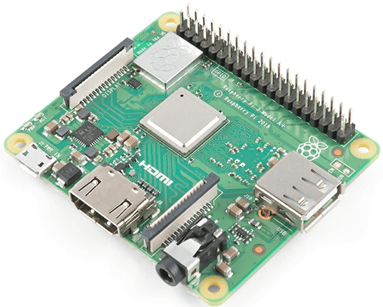
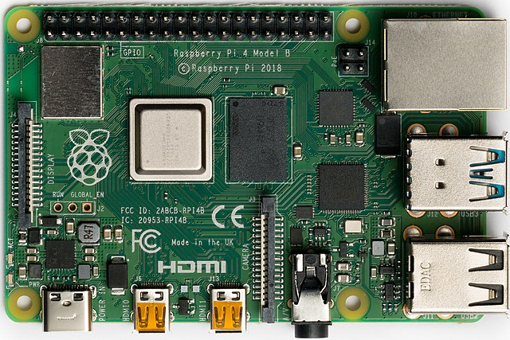
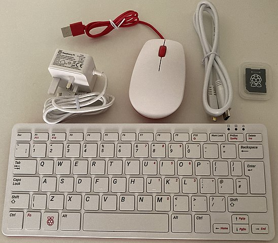
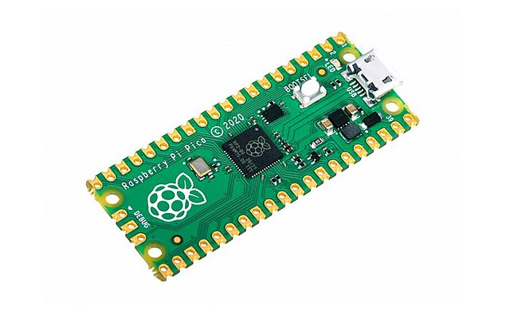

**[volver](./Raspi_home)**

# 1. Información General del sistema.

## 1.1. Introducción.

La Raspberry Pi es una serie de ordenadores de placa reducida, ordenadores de placa única u ordenadores de placa simple (SBC) de bajo costo desarrollado en el Reino Unido por la Raspberry Pi Foundation, con el objetivo de poner en manos de las personas de todo el mundo el poder de la informática y la creación digital. Si bien el modelo original buscaba la promoción de la enseñanza de informática en las escuelas, este acabó siendo más popular de lo que se esperaba, hasta incluso vendiéndose fuera del mercado objetivo para usos como robótica. No incluye periféricos (como teclado y ratón) o carcasa.

De igual manera, algunos accesorios han sido incluidos en bastantes paquetes oficiales y no oficiales.

Aunque no se indica expresamente si es hardware libre o con derechos de marca, en su web oficial explican que disponen de contratos de distribución y venta con dos empresas, pero al mismo tiempo cualquiera puede convertirse en revendedor o redistribuidor de las tarjetas Raspberry Pi], por lo que da a entender que es un producto con propiedad registrada, manteniendo el control de la plataforma, pero permitiendo su uso libre tanto a nivel educativo como particular.

En cambio, el software sí es de código abierto, siendo su sistema operativo oficial una versión adaptada de Debian, denominada Raspberry Pi OS, aunque permite usar otros sistemas operativos, incluido una versión de Windows 10. En todas sus versiones, incluye un procesador Broadcom, memoria RAM, GPU, puertos USB, HDMI, Ethernet (el primer modelo no lo tenía), 40 pines GPIO (desde la Raspberry Pi 2) y un conector para cámara. Ninguna de sus ediciones incluye memoria, siendo esta en su primera versión una tarjeta SD y en ediciones posteriores una tarjeta MicroSD.

La fundación da soporte para las descargas de las distribuciones para arquitectura ARM, Raspberry Pi OS (derivada de Debian), RISC OS 5, Arch Linux ARM (derivado de Arch Linux) y Pidora (derivado de Fedora) y promueve principalmente el aprendizaje del lenguaje de programación Python. Otros lenguajes también soportados son Tiny BASIC, C, Perl y Ruby.

La organización detrás de la Raspberry Pi consiste en dos brazos. Los primeros modelos fueron desarrollados por la Raspberry Pi Foundation. Después de que la Raspberry Pi 1 Modelo B fuese lanzado, la fundación creó Raspberry Pi Trading, con Eben Upton como CEO, para desarrollar el tercer modelo, el Raspberry Pi Modelo 1 B+. Raspberry Pi Trading es responsable de desarrollar la tecnología, mientras que la fundación es una organización sin fines de lucro educativa que tiene como objetivo promocionar la enseñanza de informática en escuelas y países en desarrollo.

Unidades vendidas de Rasperry Pi
De acuerdo a la Raspberry Pi Foundation, más de cinco millones de Raspberry Pi fueron vendidas en febrero de 2015, haciéndola la computadora británica mejor vendida. En noviembre de 2016 vendieron once millones de unidades, y 12.5 millones en marzo de 2017, haciéndolo el tercer mejor vendido "computador de propósito general". En julio de 2017, las ventas alcanzaron cerca de 15 millones. En marzo de 2018, las ventas alcanzaron 19 millones.

La mayoría de Raspberry Pis son hechas en una fábrica de Sony en Pencoed, Gales; algunas son hechas en países asiáticos como China o Japón.

---

## 1.2. Historia.

En el 2006, los primeros diseños de Raspberry Pi se basaban en el microcontrolador Atmel ATmega644. Sus esquemas y el diseño del circuito impreso están disponibles para su descarga pública.

En mayo de 2009, la fundación Raspberry Pi fue fundada en Caldecote, South Cambridgeshire, Reino Unido como una asociación caritativa que es regulada por la comisión de caridad de Inglaterra y Gales.

El administrador de la fundación, Eben Upton, se puso en contacto con un grupo de profesores, académicos y entusiastas de la informática para crear un ordenador con la intención de animar a los niños a aprender informática como lo hizo en 1981 con el ordenador Acorn BBC Micro. El primer prototipo basado en ARM se montó en un módulo del mismo tamaño que una memoria USB. Tenía un puerto USB en un extremo y un puerto HDMI en el otro.

### Pre-lanzamiento.

En agosto de 2011, se fabricaron cincuenta placas alfa, que tenían las mismas características que el modelo B, pero eran un poco más grandes para integrar bien unas interfaces para depuración. En algunas demostraciones se podía ver la placa ejecutando el escritorio LXDE en Debian, Quake 3 a 1080p y vídeo Full HD H.264 a través de la salida HDMI.

En octubre de 2011, el logotipo se seleccionó entre varios diseños enviados por miembros de la comunidad. Durante el mismo mes, se trabajó en una versión de desarrollo de RISC OS 5 y se hizo una demostración en público.

Certificado de autenticidad de una placa subastada
En diciembre de 2011, se ensamblaron y probaron 25 placas beta del modelo B de un total de 100 placas vacías. El diagrama de componentes de las placas finales sería el mismo que el de esas placas beta. Durante las pruebas a las placas beta se encontró un error de diseño en los pines que suministraban alimentación a la CPU que sería arreglado en la versión final. Se hizo una demostración de la placa beta arrancando GNU, reproduciendo un tráiler de una película a 1080p y ejecutando el benchmark Rightware Samurai OpenGL ES.

Durante la primera semana de diciembre de 2011, se pusieron a subasta diez placas en eBay. Una de ellas fue comprada por una persona anónima y se donó al Centro para la Historía de la informática en Suffolk, Inglaterra. En total se consiguieron 16,336 £. La última placa, con número de serie No. 01 se vendió por 3.500 £.

Debido al anticipado anuncio de puesta a la venta a final de febrero de 2012, la fundación sufrió colapso en sus servidores web debido a los refrescos de páginas desde los navegadores de gente interesada en la compra de la placa.

### Lanzamiento.

El primer lote de 10.000 placas se fabricó en Taiwán y China, en vez de Reino Unido. Esto fue en parte porque los impuestos de importación se pagan para los componentes individuales pero no para productos acabados, y porque los fabricantes chinos ofrecían un plazo de entrega de 4 semanas y en el Reino Unido de 12. Con este ahorro conseguido, la fundación podía invertir más dinero en investigación y desarrollo.

Las primeras ventas comenzaron el 29 de febrero de 2012 a las 06:00 UTC; al mismo tiempo se anunció que el modelo A, que originalmente iba a tener 128 MB de RAM, tendría 256 MB. La página de la fundación también anunció que "Seis años después del origen del proyecto, estamos cerca de finalizar el primer arranque del proyecto - aunque esto es solo el principio de la historia de Raspberry Pi". Por otro lado las dos tiendas que vendían las placas, Premier Farnell y RS Components, tuvieron una gran carga en sus servidores inmediatamente después del lanzamiento. La cuenta oficial de Raspberry Pi en Twitter informó que Premier Farnell vendió toda su existencia de inventario a los pocos minutos del momento de lanzamiento, mientras que RS Components tuvo 100.000 peticiones de interés el primer día. En los seis meses siguientes llegarían a vender 500.000 unidades.

### Post-lanzamiento.

Durante marzo de 2012 se anunciaron futuros retrasos en los envíos, a causa del ensamblaje de un puerto ethernet incorrecto. Por otro lado, la fundación esperaba que se pudiera aumentar la fabricación de unidades en los lotes futuros, si fuera necesario.

El 16 de abril de 2012 los primeros compradores empezaron a informar que habían recibido su Raspberry Pi. El 22 de mayo de 2012 más de 20.000 unidades habían sido enviadas. El 16 de julio se anunció que se fabricarían 4.000 unidades cada día, permitiendo ser compradas las placas en lotes. El 5 de septiembre la fundación anunció una segunda revisión del modelo B. El 6 de septiembre se anunció que se llevaría la producción de placas al Reino Unido, a una fábrica de Sony en Pencoed, Gales, y que en ella se producirían 30.000 unidades cada mes, y se crearían 30 nuevos puestos de trabajo. En octubre de 2012, se informó que clientes que habían hecho su pedido a través del distribuidor RS Components, llevaban esperando hasta seis meses en recibir sus pedidos, a causa de dificultades en la provisión de CPUs y una conservadora política de previsión de ventas.

El 4 de febrero de 2013, se lanzó el modelo A, pero debido a temas burocráticos los principales proveedores sólo lo pudieron poner a la venta ese día en Europa.

En diciembre de 2015 se pueden comprar modelos con mejores prestaciones, como la Raspberry Pi 2 Modelo B por $35. En febrero de 2016, sale a la venta un nuevo modelo, la Raspberry Pi 3 Modelo B con mejores prestaciones.

Ninguna Raspberry Pi tiene reloj en tiempo real, por lo que el sistema operativo debe usar un servidor de hora en red, o pedir al usuario la hora en el momento de arrancar el ordenador. Sin embargo se podría añadir un reloj en tiempo real (como el DS1307) con una batería mediante el uso de la interfaz I²C.

---

## 1.3. Modelos.

### Raspberry Pi 1 modelo A.

Este fue el primer modelo de Raspberry, sus ventas comenzaron en el año 2012. Carecía de puerto Ethernet, por lo que para su conexión a Internet requería de un adaptador Wi-Fi por USB. Poseía 26 conectores GPIO, salida de vídeo via HDMI y Video RCA, un conector Jack de 3.5 milímetros, un único conector USB, MicroUSB (De alimentación) y un conector de cámara. Su procesador fue un Broadcom BCM2835, Single-Core a 700MHz. También tuvo 256 MB de RAM y una gráfica Broadcom VideoCore IV. Requería de una fuente de alimentación de 5 voltios y 2 amperios, elemento común al resto de versiones. Tuvo un coste inicial de 40 euros.

### Raspberry Pi 1 modelo B y B+.

También del año 2012, es una variante del Modelo A, trajo consigo diversas mejoras, la inclusión del doble de memoria RAM, pasando de 256MB a 512MB. Trajo consigo un puerto USB más y, por fin, un conector Ethernet (RJ-45) Se mantuvo tanto su tamaño como su coste. No hubo variaciones ni en el procesador ni en la parte gráfica. Tiempo después se lanzó el Modelo B+, que incluyó 4 puertos USB y pasó de usar una SD a una MicroSD.

### Raspberry Pi 2 modelo B

Lanzada en 2014 es el primer modelo que no incluye el mismo procesador usado en los tres anteriores: se sustituye por uno de la misma marca, pero de modelo BCM2836. Pasa de ser de un núcleo a cuatro, y de 700MHz a 900MHz. No obstante emplea la misma gráfica, la VideoCore IV. Dobla la cantidad de memoria RAM, pasando de 512MB a 1GB (Algo menos en realidad) esta memoria está compartida con la gráfica. También incluye 40 pines GPIO, y mantiene los cuatro puertos USB. Suprime la conexión RCA.

### Raspberry Pi 3 modelo B

Sacada a la luz en el año 2016, renueva procesador, una vez más de la compañía Broadcom, un Quad-Core, pero pasa de 900MHz a 1.20GHz. Mantiene la RAM en 1GB. Su mayor novedad fue la inclusión de Wi-Fi y Bluetooth (4.1 Low Energy) sin necesidad de adaptadores.

### Raspberry Pi 3 modelo B+

La Raspberry Pi 3 B+ apareció en marzo del 2018 para actualizar el modelo anterior la Raspberry Pi 3 Model B y entre sus mejoras cuenta con un nuevo procesador y mejor conectividad, así que pasa de tener 1.2Ghz a tener 1.4Ghz y en cuanto a la conectividad inalámbrica ahora incorpora doble banda a 2,4GHz y 5GHz, y su nuevo puerto Ethernet se triplica, pasa de 100 Mbits/s en el modelo anterior a 300 Mbits/s en el nuevo modelo, también cuenta con Bluetooth 4.2 (Low Energy).

### Raspberry Pi 3 modelo A+

Fue anunciada en noviembre de 2018. Los modelos A+ presentan menores prestaciones a un menor precio. Cuenta con 512 MB de RAM (compartidos con la GPU VideoCore IV), un solo puerto USB y sin puerto de conexión de red por cable (RJ-45).

### Raspberry Pi 4 modelo B

Fue anunciada en junio de 2019. Se han cambiado los puertos HDMI de tamaño completo por dos puertos microHDMI. Cuenta con la capacidad de manejar una pantalla a 4K a 60 Hz, o dos pantallas 4K a 30 Hz. Se ha incluido por primera vez USB 3.0, y el puerto Ethernet ya no está limitado a 300 Mbps. Tiene un procesador Broadcom nuevo hasta tres veces más eficiente que el anterior. Están disponibles tres modelos, en los que varía la cantidad de memoria RAM, de 2GB, 4GB, y de 8GB.

### Raspberry Pi 400

La Raspberry Pi 400 fue anunciada en noviembre de 2020. Cuenta con una placa personalizada que se deriva de la Raspberry Pi 4 existente, específicamente remodelada para incluirla en un teclado derivado del Raspberry Pi Keyboard. Una solución de enfriamiento robusta (es decir, una placa de metal ancha) y un conmutador actualizado para la fuente de alimentación permite que el procesador Broadcom BCM2711C0 de la Raspberry Pi 400 tenga una frecuencia de 1,8 GHz, que es un poco más alta que la Raspberry Pi 4 en la que se basa. La computadora con teclado cuenta con 4 GB de memoria RAM LPDDR4.

### Raspberry Pi Pico

Raspberry Pi Pico. Anunciada en el 2021, es una placa pequeña y versátil construida con RP2040, un nuevo chip microcontrolador diseñado por Raspberry Pi en el Reino Unido. Este modelo está gobernada por un pequeño SoC que ha sido diseñado por los propios responsables de este proyecto. Se trata del RP2040, que cuenta con un procesador dual core ARM Cortex M0+ funcionando a 133 MHz, acompañado de 264 KB de RAM y 2 MB de almacenamiento integrado.

---

## 1.4. Tabla de especificaciones

<table class="wikitable">
<caption>
</caption>
<tbody><tr>
<th>Especificaciones
</th>
<th>Raspberry Pi 1 modelo A (descontinuada)
</th>
<th>Raspberry Pi 1 modelo B (descontinuada)
</th>
<th>Raspberry Pi 1 modelo B+
</th>
<th>Raspberry Pi 2 modelo B
</th>
<th>Raspberry Pi 3 modelo B
</th>
<th>Raspberry Pi 3 modelo B+
</th>
<th>Raspberry Pi 3 modelo A+
</th>
<th>Raspberry Pi 4 modelo B
</th></tr>
<tr>
<td>SoC (CPU, GPU, DSP, RAM y puertos USB)
</td>
<td colspan="3">Broadcom BCM2835
</td>
<td>Broadcom BCM2836
</td>
<td colspan="3">Broadcom BCM2837
</td>
<td>Broadcom BCM2711
</td></tr>
<tr>
<td>CPU
</td>
<td colspan="3">ARM 1176JZF-S a 700&#160;MHz (familia ARM11)
</td>
<td>900 MHz quad-core ARM Cortex A7
</td>
<td>1.2GHz 64-bit quad-core ARMv8
</td>
<td colspan="2">1.4GHz 64-bit quad-core ARMv8
</td>
<td>1.5GHz 64-bit quad-core Cortex-A72
</td></tr>
<tr>
<td>Juego de instrucciones
</td>
<td colspan="4">RISC de 32 bits
</td>
<td colspan="4">RISC de 64 bits
</td></tr>
<tr>
<td>GPU
</td>
<td colspan="7">Broadcom VideoCore IV, OpenGL ES 2.0, MPEG-2 y VC-1 <a rel="nofollow" class="external text" href="http://www.raspberrypi.com/license-keys">(con licencia)</a>, 1080p30 H.264/MPEG-4 AVC
</td>
<td>Broadcom VideoCore VI, OpenGL ES 3.0, 1080p30 H.264/MPEG-4 AVC, 4kp60 H.265
</td></tr>
<tr>
<td>Memoria
</td>
<td>256 MB (compartidos con la GPU)
</td>
<td colspan="2">512 MiB (compartidos con la GPU)
</td>
<td colspan="3">1 GB (compartidos con la GPU)
</td>
<td>512 MiB (compartidos con la GPU)
</td>
<td>1 GB, 2 GB, 4 GB u 8 GB (compartidos con la GPU)
</td></tr>
<tr>
<td>Puertos USB 2.0
</td>
<td>1
</td>
<td>2 (vía hub USB integrado)
</td>
<td colspan="4">4
</td>
<td>1
</td>
<td>2
</td></tr>
<tr>
<td>Puertos USB 3.0
</td>
<td colspan="7">Ninguno
</td>
<td>2
</td></tr>
<tr>
<td>Entradas de vídeo
</td>
<td colspan="8">Conector MIPI CSI que permite instalar un módulo de cámara desarrollado por la Raspberry Pi Foundation
</td></tr>
<tr>
<td>Salidas de vídeo
</td>
<td colspan="7">Conector RCA (PAL y NTSC), HDMI (rev1.3 y 1.4), Interfaz DSI para panel LCD
</td>
<td>Conector RCA (PAL y NTSC), microHDMI rev. 2.0, Interfaz DSI para panel LCD
</td></tr>
<tr>
<td>Salidas de audio
</td>
<td colspan="7">Jack de 3.5 mm, HDMI
</td>
<td>Jack de 3.5 mm, 2 puertos microHDMI
</td></tr>
<tr>
<td>Almacenamiento
</td>
<td colspan="3">SD / MMC / ranura para SDIO
</td>
<td colspan="5">MicroSD
</td></tr>
<tr>
<td>Conectividad de red
</td>
<td>Ninguna
</td>
<td colspan="3">10/100 Ethernet (RJ-45) vía hub USB
</td>
<td>Puerto RJ-45 (ethernet) de 10/100Mbps vía hub USB

Wi-Fi 802.11bgn

Bluetooth 4.1

</td>
<td>Puerto RJ-45 (Ethernet) de 10/100/1000Mbps vía hub USB limitado a 300Mbit/s

Wi-Fi 802.11ac de doble banda
Bluetooth 4.2 BLE

</td>
<td>Wifi 802.11ac de doble banda

Bluetooth 4.2 BLE

</td>
<td>Puerto RJ-45 10/100/1000Mbps vía hub USB 3.0

Wi-Fi 802.11ac de doble banda

Bluetooth 5.0 BLE

</td></tr>
<tr>
<td>Periféricos de bajo nivel
</td>
<td colspan="3">8&#160;x&#160;<a href="/wiki/GPIO" title="GPIO">GPIO</a>, <a href="/wiki/Serial_Peripheral_Interface" title="Serial Peripheral Interface">SPI</a>, <a href="/wiki/I%C2%B2C" title="I²C">I²C</a>, <a href="/wiki/Universal_Asynchronous_Receiver-Transmitter" title="Universal Asynchronous Receiver-Transmitter">UART</a>
</td>
<td colspan="5">17 x GPIO y un bus HAT ID
</td></tr>
<tr>
<td>Consumo energético
</td>
<td>500&#160;mA (2.5 W)
</td>
<td>700 mA (3.5 W)
</td>
<td>600 mA (3.0 W)
</td>
<td colspan="4">800 mA (4.0 W)
</td>
<td>Máximo 3A (15.3 W)
</td></tr>
<tr>
<td>Fuente de alimentación
</td>
<td colspan="7">5&#160;V vía <a href="/wiki/Micro_USB" class="mw-redirect" title="Micro USB">Micro USB</a> o puerto GPIO
</td>
<td>5 V vía USB-C o puerto GPIO
</td></tr>
<tr>
<td>Dimensiones
</td>
<td colspan="8">85mm x 53mm
</td></tr>
<tr>
<td>Sistemas operativos soportados
</td>
<td colspan="7">GNU/Linux: <a rel="nofollow" class="external text" href="https://www.raspberrypi.org/downloads/raspbian">Raspbian</a>, <a href="/wiki/Fedora_(distribuci%C3%B3n_Linux)" class="mw-redirect" title="Fedora (distribución Linux)">Fedora</a> (Pidora), <a href="/wiki/Arch_Linux" title="Arch Linux">Arch Linux</a> (Arch Linux ARM), <a href="/wiki/Slackware_Linux" class="mw-redirect" title="Slackware Linux">Slackware Linux</a>, SUSE Linux Enterprise Server for ARM, <a rel="nofollow" class="external text" href="https://www.riscosopen.org/content/downloads/raspberry-pi">RISC OS</a>
</td>
<td>GNU/Linux: <a rel="nofollow" class="external text" href="https://www.raspberrypi.org/downloads/raspbian">Raspbian</a>
</td></tr></tbody></table>

**[volver](./Raspi_home.md)**

**[Subir](#top)**

**[Home](/home)**
