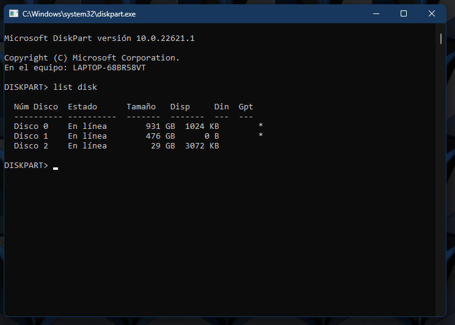
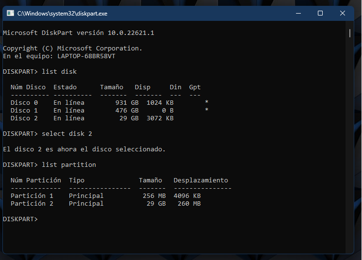
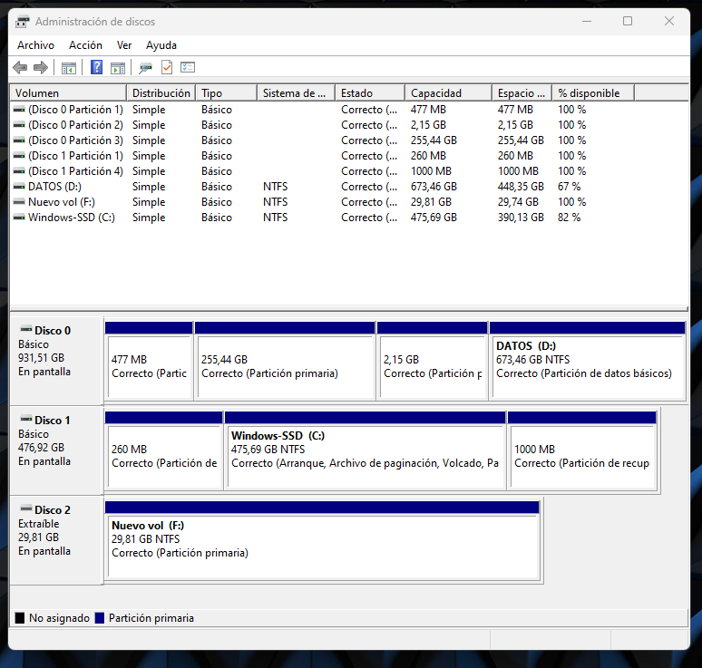

**[volver](./Raspi_home)**

---

# ACCIONES PREVIAS DE LA INSTALACION DEL SO RASPBIAN EN LA TARJETA MICRO SD

### Introducción.

En este capitulo procederemos a explicar las acciones previas para poder iniciar la instalación del SO Raspbian en la tarjeta MicroSD.

---

## 1. Insertar Tarjeta Micro SD en el PC

### Introducción

En el Caso estudiado, se ha procedido a arrancar un PC con SO Windows 11 ya que los programas que correremos están pre-instalados en este sistema operativo.

En la siguiente imagen se muestra la tarjeta MicroSD a instalar y el lector que vamos a usar durante este proceso y el de la instalación del sistema operativo Raspbian.

~ Conjunto Tarjeta MicroSD-Lector Tarjetas MicroSD.

### Acciones previas a realizar

- Se procede a Colocar la tarjeta MicroSD dentro del lector de tarjetas, tal como se observa en la siguiente imagen.

~ Colocación de la tarjeta microSD en lector.

- Se inserta lector de tarjetas microSD en el PC, tal y com se observa en la  siguiente imagen.

~ Colocación del lector de tarjetas en el PC.

- A continuación se deberá de detectar una unidad de memoria, por la inserción del lector de tarjetas MicroSD.

---

## 2. borrado completo de la tarjeta MicroSD

### Introducción

Una vez detectada la unidad USB, se procedera a la limpieza de la unidad de disco. Para ello, usaremos diskpart y diskmgmt.

### Acciones a realizar

- Se procede a arrancar el CMD de windows, o también conocido como símbolo del sistema.

~ Seleccion de CMD.

- Se procede a escribir en el CMD `diskpart`, con ello se comenzará a ejecutar la aplicación.

~ Comando para ejecutar DiskPart.

- nos aparecerá una ventana nueva al estilo del CMD con la aplicación diskpart ejecutándose.

- El primer comando que deberemos de ejecutar serrá `list disk`, de este modo, podremos ver los discos duros que tiene detectados el sistema operativo.

~ Comando `list disk`.

-Analizando la situación de la imagen y las de este documento, la única unidad que concuerda con la tarjeta microSD es el disco 2, el cual tiene 29GB, por lo que procedemos a selecionarlo con el comando `select disk 2`.

~ Seleccionamos disco.

- A continuación vamos a ver las particiones de esta unidad, para ello como ya estamos dentro del disco 2, con el comando `list partitions` veremos las particiones.

~ Listado de particiones del disco.

- Visto que es el disco a limpiar, procedemos a su limpieza a través del comando `clean`.

- En nuestro caso nos detecto un error, puede ser por comunicaciones del lector de tarjetas u otra razón no definida, al devolver el pc este error, se recomienda de nuevo iniciar el proceso, seleccionando el disco de nuevo, aunque aparece con el `*`, lo cual significa que esta seleccionado, y procederse a su limpieza con el comando `clean`.

~ Limpieza del disco duro.

- Una vez borrada la unidad, queda pendiente el formateo de la unidad para poder usarla, para ello, procedemos a salir de la aplicación diskpart.
  - Cabe destacar que esta aplicación también permite el formateado de la tarjeta, pero se ha decidido realizar el formateo con una aplicación con interfaz mas amigable

---

## 3. Formateado de la tarjeta MicroSD

### Introducción

Una vez que la tarjeta MicroSD ha sido borrada, se procederá a dar formato a la tarjeta microSD, para ello usaremos la aplicación diskmgmt, esta aplicación es también conocida como el administrador de discos. una aplicación que años atrás solo era desconocido por mi en los SO ordenador, sino que eran propio de SSOO de servidores.

### Acciones a realizar

- En el símbolo del sistema, procederemos a escribir el comando `diskmgmt`.

~ Comando `diskmgmt`.

- Aparecerá la ventana de Administración de discos.

~ inicio  diskmgmt.

- Como podemos observar, el disco 0 y 1 son discos que están inicializados y con un particionado correcto. sin embargo, el disco 2 no esta asignado, por lo que procederemos a formatear e inicializar el disco.
- se procede a seleccionar el disco 2, para ello se hace click derecho para que salga el menu desplegable y se hace click en *Nuevo volumen simple*

~ Nuevo volumen simple.

- Una vez ejecutado el paso anterior, aparecerá la ventana para del *Asistente para nuevo volumen simple*

- Click en Siguiente para continuar

~ Click en Siguiente.

- Especificaremos el tamaño, en este caso haremos click en siguiente.

~ Especificar tamaño $\rightarrow$ Siguiente.

- A continuación, el asistente nos pedirá asignar una ruta de acceso o monar en una carpeta NTFS vacía, en nuestro caso hemos asignado letra, posteriormente hemos hecho click en siguiente.

~ Asignación de letra de unidad o ruta de acceso.

- la siguiente acción que se solicita es establecer el formateo del la tarjeta, en este caso elegiremos NTFS y las opciones por defecto que se muestran en la siguiente imagen.

~ Ventada de formatear la particion.

- Por ultimo, el asistente resume las acciones a realizar, confirmamos haciendo click en finalizar.

~ Finalización del asistente.

-Una vez formateado el disco, podemos ver que el disco que usaremos para instalar Raspbian esta correcto y operativo (linea azul).

~ Disco preparado para instalar Raspbian.

- Por ultimo procedemos a cerrar el diskmgmt.

---

**[volver](./Raspi_home.md)**

**[Subir](#top)**

**[Home](/home)**
