

**[volver](./Raspi_home)**

# Instalación de SO Raspbian en la tarjeta SD

### Desde un Pc Windows

- Se procede a la instalación de la aplicación Raspberry Pi Imager
  - Se puede descargar la aplicación en la siguiente URL https://www.raspberrypi.com/software/.

- Se procede a su Instalación.

- Se procede a insertar la tarjeta Micro SD que se usará en la "Raspi" en el pc.

- Se procede a ejecutar Raspberry Pi Imager

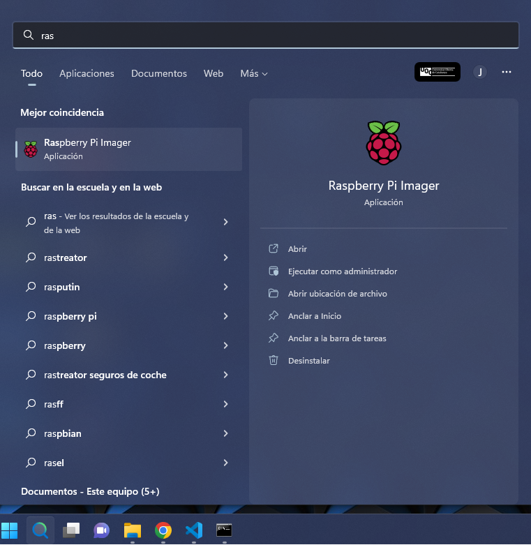
~ Arrancar aplicación.

- Aparecerá la pantalla de la aplicación.

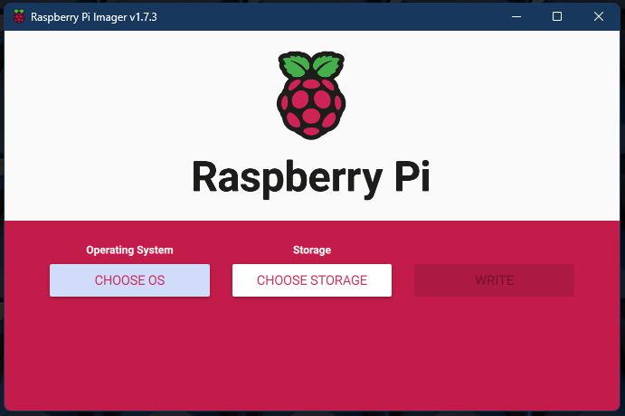
~ Inicio de Raspberry Pi Imager.

- Seleccionamos ***CHOOSE OS*** $\rightarrow$ ***Raspberry Pi OS (other)*** $\rightarrow$ ***Raspberry Pi OS Full (32-bit)***.

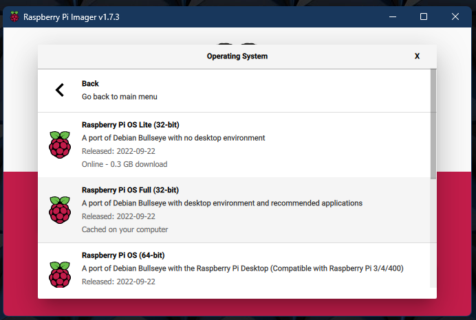
~ Selección de Sistema Operativo.

- A continuación, nos devuelve a la pagina principal de la aplicación con el SO seleccionado.

- Seleccionamos ***CHOOSE STOREAGE*** $\rightarrow$ ***Mass Storage Device USB Device - 32.0GB***

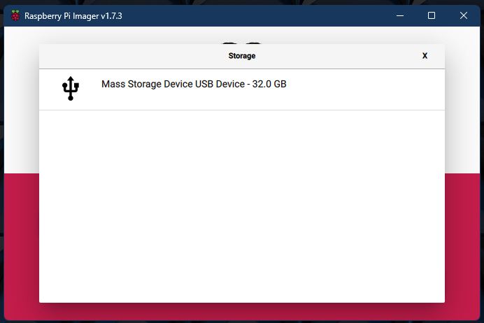
~ Selección de Unidad.

- Volverá a la pantalla principal con la unidad USB (donde se encuentra la tarjeta micro SD)

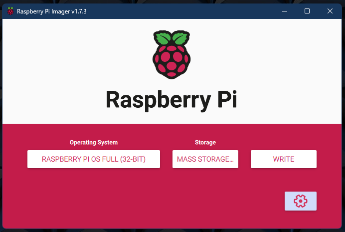

- Procedemos a hacer click en el engranaje.

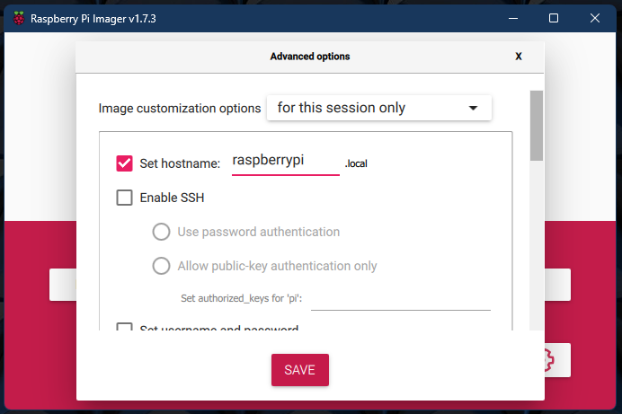
~ Configuración de datos.
- Procedemos a realizar las siguiente configuración:
  - Set Hostname.
  - Enable SSH.
    - Use Password authentication.
  - Set Username and password.
    - Escribimos User y password que tendrá la Raspberry.
  - Configure wireless LAN:
    - Wireles LAN country $\rightarrow$ ES
  - Set locale setting:
    - Para Time Zone yo uso $\rightarrow$ Etc/UTC.
    - Para keyboard layout seleccionamos $\rightarrow$ es.
- Pulsamos el botón $\rightarrow$ SAVE.
- Pulsamos el botón $\rightarrow$ WRITE.

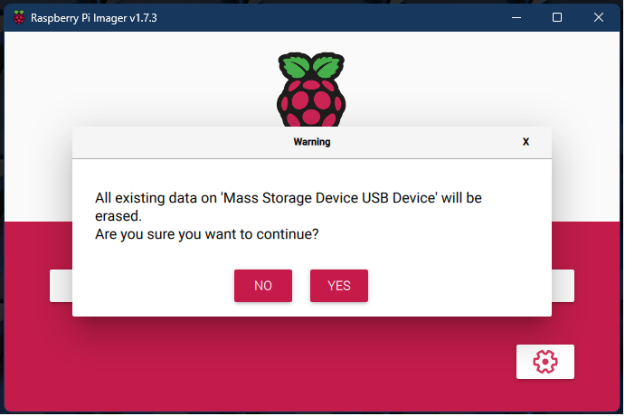

- Diremos que si a la advertencia ya que eliminaremos todos los datos de la tarjeta SD.

- Se procede a la instalación de Raspbian en el dispositivo SD.

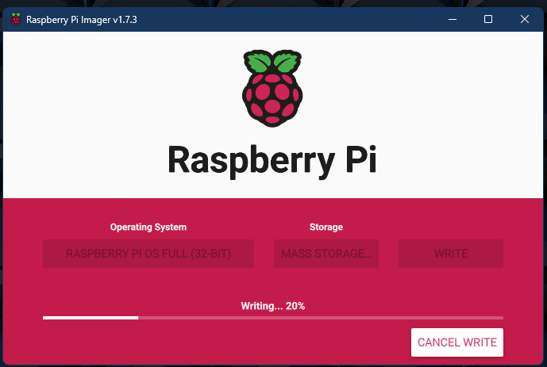
~ Carga del SO en la SD

- Tras la instalación, la aplicación procede a comprobar la correcta instalación del SO en la tarjeta SD.

~ Verificación de la correcta instalación del SO en la SD

- La instalación del SO en la SD habrá finalizado.

- Se procede la configuración para poder arrancar el dispositivo.
  - Se extrae la tarjeta SD del PC y se procede a su colocación en la Raspberry.

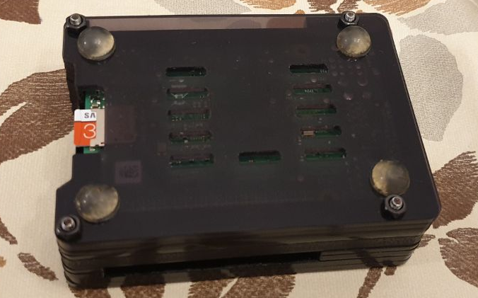
~ Colocación Tarjeta MicroSD

- Se procede a conectar lo siguiente:
  - Entrada USB-C $\rightarrow$ fuente de alimentación
  - Entrada USB 2.0 $\rightarrow$ Teclado y ratón (en nuestro caso es inalámbrico y solo es necesario un puerto USB).
  - Salida Micro-HDMI $\rightarrow$ monitor a través de cable HDMI y cable de transición HDMI hembra a micro-HDMI macho.

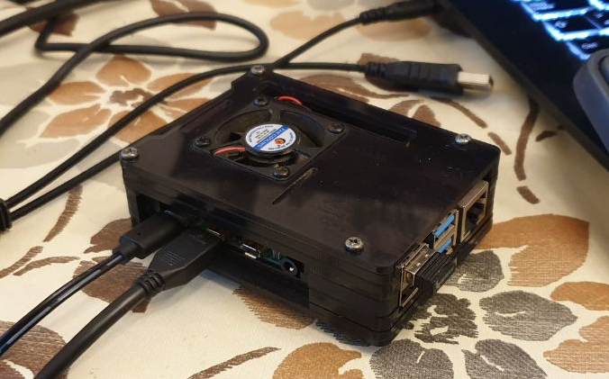
~ Conexiones Raspberry

- Procedemos a su encendido.
  - Durante el encendido de este... si a los **3 minutos** la Raspberry parece haberse quedado colgada, es decir ves la pantalla en negro durante al menos **durante esos 3 minutos, nunca menos**.
    - Se procede a un apagado y encendido manual, esta acción posiblemente la tengas que repetir 3 o 4 veces. Si hubiera que hacer una quinta vez, mejor inicializar la instalación de 0 de la tarjeta SD.

- En nuestro caso, al usar una pantalla de Tv de 45", es necesario cambiar la configuración de la pantalla para ponerla mas acorde a la distancia de la pantalla.
  - Para ello, haremos click en el logotipo de Raspberry (arriba a la izquierda por defecto) $\rightarrow$ Preferences $\rightarrow$ Raspberry Pi Configuration.

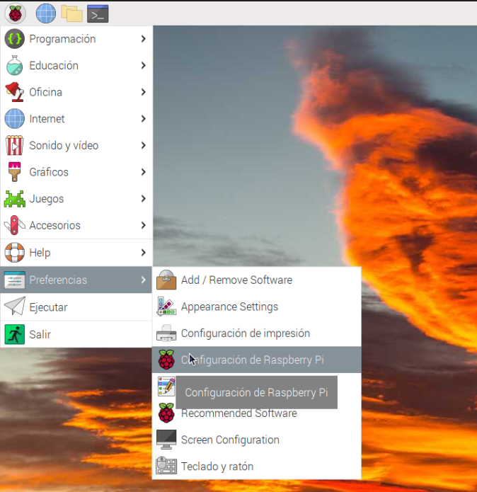
~ Conexiones Raspberry: obsérvese en este caso de la imagen que esta en español.

- Ahora configuraremos la resolución para VNC cuando el monitor no esta conectado.
  - En la pestaña de Display, seleccionaremos el desplegable de Headless Resolution: $\rightarrow$ 1920x1080.

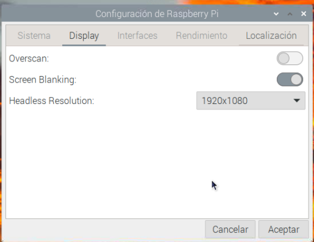

- Activaremos VNC para su posterior conexión a través de este sistema.
  - Seleccionamos en la pestaña interfaces y activaremos el check de VNC.

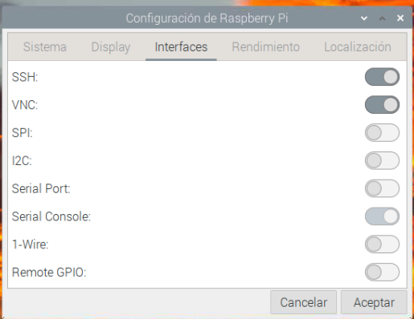

- Por ultimo, en Raspberry Pi Configuration, procederemos a la pestaña Localisation y comprobaremos todos los apartados. En mi caso, no tenían concordancia con lo indicado previamente se había cargado durante la instalación de Raspbian en la SD.
  - Locale $\rightarrow$ Set Locale...
    - Language $\rightarrow$ es (Spanish).
    - Country $\rightarrow$ ES (Spain).
    - Character set $\rightarrow$ ISO-8859-1.
    - Aceptamos.

~ Locale Raspberry Pi Configuration: obsérvese en este caso de la imagen que esta en español.

  - Timezone $\rightarrow$ Set Timezone...
    - Area: $\rightarrow$ UTC.
    - Location: $\rightarrow$ en blanco.
    - Aceptamos.

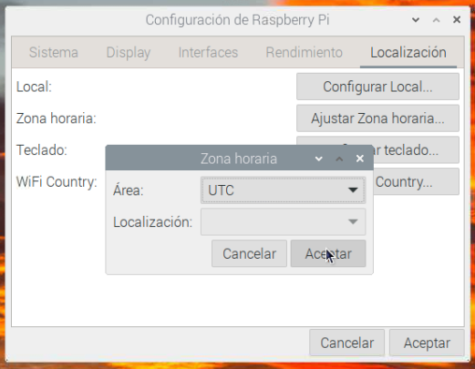
~ Timezone Raspberry Pi Configuration: obsérvese en este caso de la imagen que esta en español.

  - Keyboard: $\rightarrow$ Set Keyboard...
    - Model: $\rightarrow$ Generic 105-key PC (intl.).
    - Layout: $\rightarrow$ Spanish.
    - Variant: $\rightarrow$ Spanish.
    - Aceptamos.

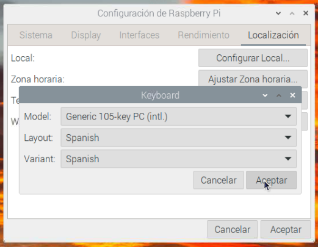
~ Keyboard Raspberry Pi Configuration: obsérvese en este caso de la imagen que esta en español.

  - Wireless LAN Country $\rightarrow$ Set WLAN Country...
    - Country: $\rightarrow$ ES Spain.
    - Aceptamos.

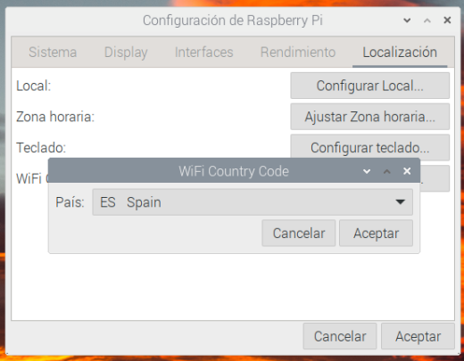
~ Wireless LAN Country Raspberry Pi Configuration: obsérvese en este caso de la imagen que esta en español.

  - Aceptamos

- Pedirá el reinicio de la Raspberry, le diremos que si para que todas las configuraciones tengan efecto.

- Procedemos a su reinicio.

- Una vez reiniciado el sistema procedemos a ver la configuración de VNC para ello haremos click en el icono de VNC situado en la parte superior derecha.

~ Icono VNC

- Nos aparecerá una ventana en la que nos indicará la manera de conexión a través de VNC, en nuestro caso a través de la dirección ip 192.168.1.71, dirección IP de la LAN a la cual la Raspberry esta conectada.

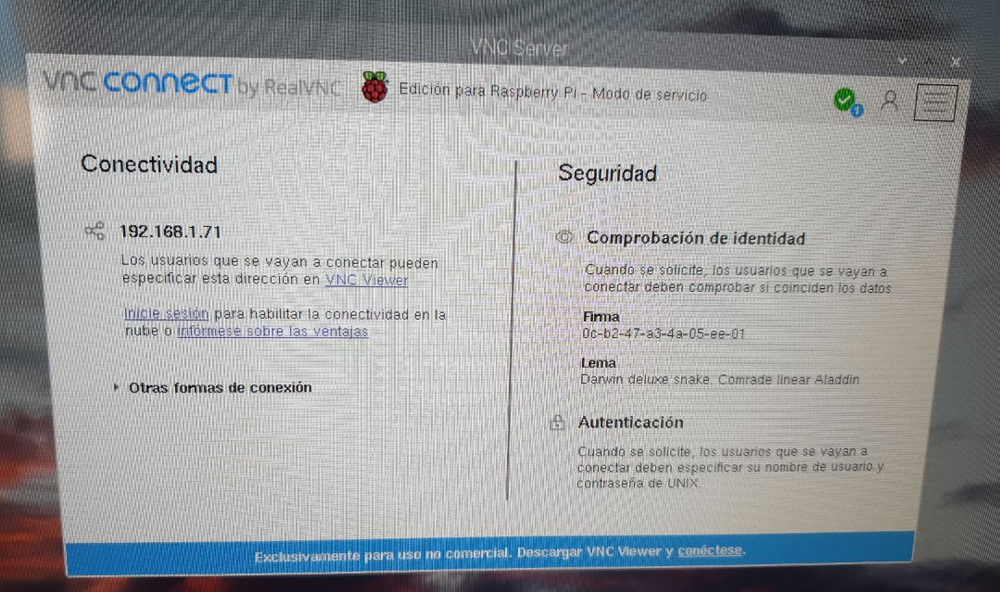
~ Ventana enlace VNC

- Procederemos al apagado de la Raspberry y a su instalación en su emplazamiento definitivo sin necesidad de conectar teclado ni salida micro-HDMI.

- En nuestro caso hemos conectado un cable de red para hacer después la conexión con el router de manera física.

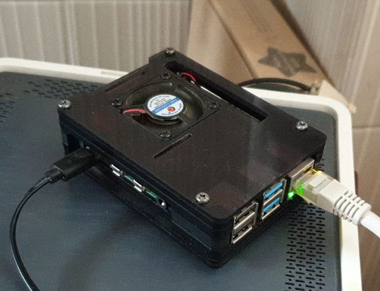
~ Ventana enlace VNC

---

