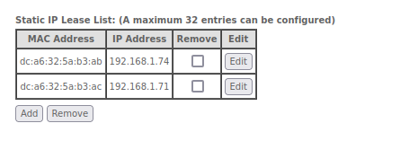
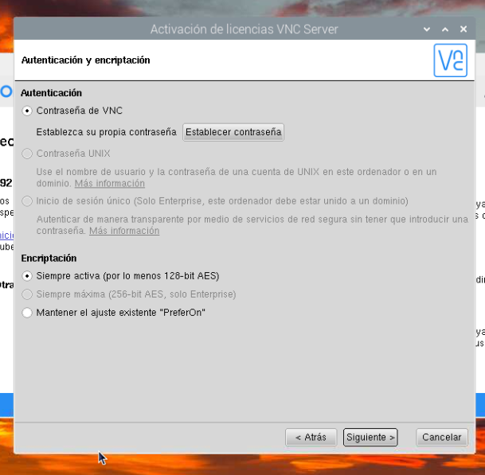
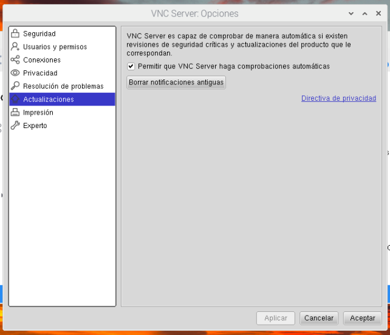
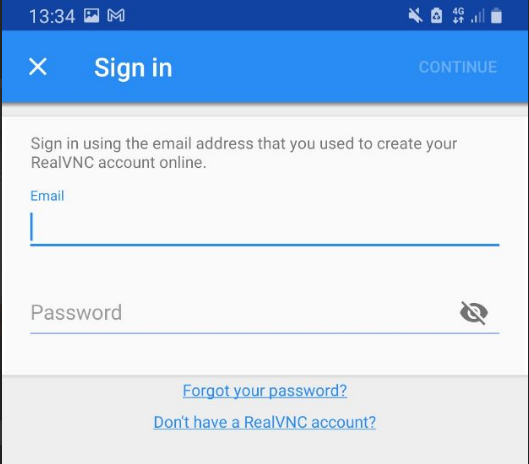

**[volver](./Raspi_home)**

---

# Configuración inicial del Servidor Raspberry.

### Introducción.

Una vez ya instalado de manera definitiva y arrancada la Raspberry, se procede a realizar las configuraciones básicas para no tener que trabajar con la Raspberry en nivel local, sino poder estar en cualquier parte y hacer las gestiones necesarias para su mantenimiento, de estas acciones tratará este apartado de la wiki.

---
## 1. Configuración de la lan de nuestro router.

### Introducción.

En este apartado procederemos a reafirmar que los datos de conexión de nuestra Raspberry son correctos.

### Acciones a realizar.

- vamos a entrar en nuestro router a través del explorador de internet, escribiremos en nuestra barra de direcciones la dirección de la puerta de enlace predeterminada (Gateway) de nuestro pc.

- Si hacemos el comando con `ifconfig` o con `ip address`, no aparece expresamente la dirección IP de nuestro Gateway.

~ Comando `ifconfig`

~ Comando `ip address`

- Para solucionar este problema podemos hacer uso del comando ´traceroute` ello si no sabemos la configuración de internet, en una consola escribiremos el comando `traceroute`.
  - Por lo que procederemos a instalar el paquete que nos permite hacer el traceroute con el siguiente comando `sudo apt-get install inetutils-traceroute`

~ Instalando traceroute.

  - Una vez instalado realizamos el comando `traceroute` y de destino ponemos pos ejemplo, `www.google.es`
  - El primer salto que encuentre el comando `traceroute` es la dirección ip de nuestro de Gateway del router de nuestro ISP.

~ Ejecutando un `traceroute` a Google.

- Como podemos ver, la dirección IP del router de nuestro ISP es 192.168.1.1.

- Procedemos a entrar en el router de nuestro ISP. en nuestro navegador escribiendo lo siguiente en nuestra barra de direcciones $\rightarrow$ `http://192.168.1.1`.

- En nuestro caso, nuestro ISP es Movistar, por lo que procedemos a introducir la contraseña de administración de nuestro router.

~ Entrando en el router de nuestro ISP

- A continuación procedemos a introducir su contraseña, una vez accedidos en el sistema, procedemos a hacer click en menu $\rightarrow$ Red Local $\rightarrow$ Mapa red local.

~ Entrando en el mapa de red local

Dentro del mapa de red local podemos encontrar dos dispositivos llamado Buluju, estos dispositivos son en verdad el mismo dispositivo, la razón por la que aparece es porque se conectan al router por la interfaz wifi y a través de un cable Ethernet con conector RJ-45 como se observa en la ultima imagen del apartado anterior.

~ Mapa de red local

En la siguiente imagen, podemos ver que puertos usa la Raspberry para conectarse, uno de ellos la 192.167.1.71, la cual corresponde a su interfaz wifi, y la 192.168.1.74, la cual corresponde al cable Ethernet.

~ 192.168.1.71

~ 192.168.1.74

- sabiendo estas configuraciones, procederemos a usar VNC para conectarnos a la Raspberry Pi A través de VNC.

---
## 2. Configuración de VNC para poder configurar la Raspberry a distancia.

### Introducción.

 Raspbian ya viene por defecto con el Servidor VNC activado, por lo que procederemos a instalar en los dispositivos desde donde nos conectaremos al servidor. Se explicarán las acciones a realizar desde un pc con SO Linux.

### Entrar en Raspberry a través de VNC.

- Iremos a la siguiente URL y procederemos a instalar el VNC Viewer.

  - https://www.realvnc.com/es/connect/download/viewer/linux/

- Una vez descargado el archivo procedemos a ejecutar los siguientes comandos en la consola

~~~
sudo apt update
sudo apt upgrade
sudo apt autoremove
~~~

- Procedemos a cerrar la terminal, y abriremos otra en descarga, a continuación procederemos a ejecutar los siguientes comandos.

~~~
sudo apt -f install ./VNC-Viewer*.deb
~~~

- Una vez instalado en el sistema se procede a ejecutar el VNC pulsamos el  icono de mostrar aplicaciones y a continuación escribimos VNC.
- Nos aparecerán dos aplicaciones, VNC Viewer y Remmina, Seleccionaremos VNC
  - La aplicación Remmina también nos permitirá conectarnos a través de VNC a la Raspberry, pero puede ser que tengamos problemas con la conexión o esta no sea tan intuitiva com es el caso que nos atañe

- Una vez dentro de la aplicación, nos aparecerá una ventana similar como la que se muestra en la siguiente imagen.

~ Inicio aplicación VNC

- Debemos recordar que en nuestro caso, tenemos la sesión con la ip 192.168.1.71 la cual es la conexión a través de la interfaz Wifi a la LAN donde se ubica la Raspberry para tener conexión a internet.

  - Escribimos la IP 192.168.1.71 en la barra de dirección.
  - Nos pedirá en este caso el usuario y la contraseña para acceder al dispositivo., procedemos a escribir nuestro usuario y contraseña y procedemos a entrar.

~ Acceso a la Raspberry Pi

- Posiblemente nos pregunte si confiamos en el dispositivo que entramos, esto es porque la primera vez, cuando te conectas a este dispositivo te pregunta si el dispositivo es conocido por ti, puede hasta mostrarte una SHA con un fingerprint, para certificar que ese es el dispositivo a conectarte.
  - como yo he hecho un reconocimiento de la red y la IP es correcta, se exactamente que ese es el dispositivo al que me quiero conectar.

~ Escritorio del dispositivo desde VNC.

### Configurar el router para que asigne de manera fija las IP a las Raspberry.

- El siguiente paso a realizar es fijar las direcciones IP de la Raspberry para que aunque haya un apagón de luz, por una razón o por otra, el router siempre asigne las mismas direcciones IP al dispositivo.

- Para ello haremos el comando ifconfig dentro de la Raspberry. y buscaremos las MAC's de nuestro dispositivo.

~ Dirección MAC Ethernet.

~ Dirección MAC Wifi.

- A continuación volvemos a la web del router de nuestro ISP para activar la asignación manual de estas direcciones IP a estas MAC en concreto.
  - Para ello una vez dentro del router, procederemos a entrar en la configuración avanzada. Procederemos a aceptar la advertencia que nos indica, y posteriormente  haremos click en lo siguiente.
    - Advanced Setup $\rightarrow$ LAN.

~ Configuración Avanzada.

~ Advertencia del ISP

~ Advanced Setup.

- Buscaremos en este ventana el apartado de *Static IP Lease List: (A maximum 32 entries can be configured)*.
- Haremos click en add y añadiremos las direcciones MAC y las direcciones IP asignadas.
  -Una vez escritas la MAC y la IP procedemos a hacer click en `Apply/Save`

~ Asignando IP definitiva a mac Eth0.

~ Asignando IP definitiva a mac Wlan0.

- Ahora comprobaremos que las direcciones MAC e IP han sido correctamente insertadas.

~ Asignando IP definitiva a mac Wlan0.

- Una vez comprobado esto podremos estaremos seguros de que la Raspberry Pi tendrá la misma dirección IP

### Configuración del servidor VNC para poder tele-configurar la Raspberry.

Ahora mismo el servidor VNC solo permite entrar por direcciones IP, ahora, procederemos a configurar el servidor VNC para que funcione correctamente desde cualquier parte del mundo. Los pasos a seguir se definen a continuación.

- Entramos en el servidor VNC de nuestro PC.
- Procederemos a iniciar sesión.
- En caso de no cuenta de usuario, se puede hacer click en *¿No tiene una cuenta?* y se puede, esto te redirigirá a [este enlace](https://manage.realvnc.com/en/auth/sign_up?utm_campaign=vnc-connect-sw&utm_medium=referral&utm_source=vncviewer-linux-6.22.515.47347) para que completes el formulario.

~ Inicio sesión en cuenta VNC.

Una vez iniciado sesión nos aparecerá un panel, donde tendremos las direcciones IP y un Equipo, Este Team, permitirá poder conectarte desde cualquier lugar con conexión a internet a la Raspberry y poder configurar el dispositivo.

En Direcciones estará la anteriormente usada para conectarnos remotamente a la Raspberry Pi, la cual solo valdrá para conectarse en Local.

Sin embargo en el Equipo (Team), añadiremos la Raspberry a continuación.

~ Team VNC.

- Entramos en la Raspberry por el apartado de direcciones.

~ Acceso a Raspberry, obsérvese que aparece en miniatura la ultima pantalla observada del dispositivo.

Una vez dentro, revisaremos de que no tenemos actualizaciones pendientes, en nuestro caso si que las tenemos.

~ Actualizaciones.

- Para ello, ejecutamos los siguientes comandos

~~~
sudo apt update
sudo apt upgrade
~~~

~ `sudo apt update`.

~ `sudo apt upgrade`.

Como podemos ver en la siguiente imagen, al hacer `sudo apt upgrade` nos ha recomendado hacer después un `sudo apt autoremove` para eliminar paquetes obsoletos. De modo que posteriormente procederemos a ejecutar este comando.

~ `sudo apt autoremove`.

por ultimo haremos un `sudo reboot` para reiniciar el dispositivo. Como podemos ver la imagen, pierde conexión, la cual se restaurará sin dificultades.

~ `sudo apt reboot`.

Una vez reiniciado el  dispositivo, comprobamos que no es necesario realizar actualizaciones de nuevo.

~ Actualizado.

A continuación y volviendo al tema que nos trata, procedemos a entrar en la configuración VNC de nuestra Raspberry Pi.

En ellas podremos ver que debajo de la dirección Ip de configuración (ahora dice la 192.168.1.74 porque es la de Ethernet, la de mayor fiabilidad y velocidad) indica lo siguiente
- *Inicie sesión para habilitar la conectividad en la nube o infórmese sobre las ventajas*.

~ Ventana de VNC en Raspberry.

- Procedemos a iniciar sesión tal y como hemos hecho anteriormente en nuestro PC.

~ Inicio de sesión cuenta VNC.

- A continuación nos pedirá un método de conectividad.
  - Dejaremos activados los loc checkbox de *Permitir conexiones en la nube* y *Permitir conexiones directas*.

~ Conectividad.

- La siguiente pantalla del asistente de conexión de la Raspberry será la de Autenticación y encriptación.
  - En el apartado encriptación, procederemos a dejar seleccionada la opción de *Siempre activa (por lo menos 128-bit AES)*.
  - haremos click en `Establececer contraseña`.

~ Autenticación y encriptación.

- Procederemos a escribir la contraseña de acceso al dispositivo a través de VNC teams.

~ Establecer Contraseña.

- A continuación se procederá a gestionar el acceso ak dispositivo. En este caso, las opciones de control de usuario están bloqueadas a solo acceso al dispositivo a través de los administradores.
- Si que es importante tener desactivado el checkbox de *Requerir un usuario con sesión iniciada para aprobar las conexiones*. Si este checkbox esta activado, se necesitaría una persona con teclado y monitor para poder administrar el dispositivo, lo cual no es recomendable en caso que el dispositivo vaya a estar  funcionando de manera desatendida.

~ Control de acceso.

- La siguiente pantalla que nos muestra es un resumen de los cambios a realizar en el servidor VNC, la única posibilidad que nos permite realizar es cambiar el nombre del dispositivo que aparecerá en el panel de usuario de VNC viewer. Se puede observar, a su ves que los ordenadores integrados en el equipo son 0 de 5.
  - En nuestro caso le damos a `Siguiente`.

~ Resumen.

- La pantalla actualizará los datos, ahora podemos ver que el dispositivo ha sido agregado correctamente al equipo.

~  Dispositivo agregado al equipo VNC.

- Una vez vuelto a la pantalla principal del servidor VNC, se podrá observar que ahora uno se puede conectar mediante tres direcciones maneras.
  - Dirección IP de la interfaz Wifi.
  - Dirección IP de la interfaz de cable Ethernet.
  - Team VNC relativo a la cuenta personal.

~ Panel principal una vez configurado VNC para poder conectarse a través de un equipo.

- El siguiente proceso a seguir es comprobar que las opciones del servidor VNC son las correctas.
  - Haremos click en el menu de la pantalla principal que se sitúa en la parte superior derecha de la ventana y haremos click en *Opciones...*

~ Entrar en opciones.

-El primer apartado que nos presenta y, se recomienda que la configuración este de la manera indicada en la siguiente imagen.

~ Opciones de seguridad.

La siguiente pantalla que nos muestra es relativo a usuario y permisos, en este apartado se considera que sea de la misma manera que la indicada ena siguiente imagen.

~ Usuarios y permisos.

El siguiente apartado que se puede observar es el de las conexiones.
- Habrá que prestar especial atención en los siguientes apartados.
  - En Conectividad.
    - tanto *Permitir conexiones en la nube* como *Permitir conexiones directas de VNC a través de TCP*.
  - Filtrar conexiones directas.
    - De momento, aceptaremos cualquier otra conexión IPV4/IPV6. En el caso de Configurar una VPN hacia la LAN, que se hará próximamente, se podría esta regla, en cierta manera restringir.
  - Filtrar usuarios que se conectan.
    - Mantendremos deshabilitado el checkbox de *Mostrar petición de aceptar/rechazar para cada conexión*.
      - Tener activado este Checkbox, no nos podría permitir conectarnos de manera autónoma al dispositivo.
  - Servidor Proxy, usaremos la opción *Utilizar configuración proxy del sistema (recomendado)*

~ Conexiones).

La siguiente pantalla que nos muestra es relativo a privacidad, en este apartado se considera que sea de la misma manera que la indicada ena siguiente imagen.

~ Privacidad.

La siguiente pantalla que nos muestra es relativo a privacidad, en este apartado se considera que sea de la misma manera que la indicada ena siguiente imagen.

Relativo a las configuraciones de Impresión y Experto, no son necesarias ser revisadas puesto que impresiones no se van a realizar en el dispositivo, ni se va a hacer un uso de las opciones de experto pues se necesitan un conocimiento muy profundo de la aplicación y el dispositivo.

~ Actualizaciones.

### Acceso al dispositivo a través de un dispositivo móvil.

Una de las ventajas de la aplicación VNC, es que tiene su propia aplicación para dispositivos móviles, por lo que podemos configurar nuestra Raspberry a través de un dispositivo móvil. En nuestro caso a exponer, usaremos un móvil del tipo Android

- Primero de todo procedemos a descargarnos la aplicación de *VNC Viewer - Remote Desktop* desde Pay Store.
  - En la siguiente imagen se pueden ver los detalles de la aplicación para su correcta descarga.

~ Inicio Sesión cuenta VNC.

- Una vez instalado deberemos de buscar en nuestro dispositivo móvil el icono de VNC Viewer, como se muestra en la siguiente imagen.

~ Icono de VNC.

Una vez ingresado en la aplicación, nos pedirá que ingresemos la cuenta de usuario para poder ver los dispositivos que tenemos en nuestro VNC team, o las conexiones abiertas con nuestra sesión. Por tanto haremos click en *Sing in*.

~ Inicio VNC desde app móvil.

- Introduciremos usuario y contraseña de nuestro VNC Teams.
  - Una vez logueados correctamente, nos pedirá una confirmación por correo electrónico, por lo que tendremos que aceptar para poder loguearnos correctamente en nuestro dispositivo móvil.

~ Inicio de sesión cuenta VNC en app móvil.

- En la siguiente imagen podemos ver que se ha procedido correctamente al login y podemos ver los paneles de conexión de la misma manera que los podemos ver en nuestro pc, las conexiones realizadas desde el pc y las de a través de VNC Team

En la siguiente imagen procederemos a entrar ver el menu de `Address Book` como  `lord's Team (home)`

~ Address Book.

~ lord's Team (home).

Vamos a hacer una prueba de tratar de ingresar con nuestro dispositivo móvil a través de la dirección IP sin estar conectado a la Wifi donde se encuentra la LAN de la Raspberry Pi. Quedandose en este estado sin poder conectar.

~ Acceso a través de dirección IP sin conectar a Wifi.

En las siguientes imágenes se puede observar como nos conectamos a través de la conexión Buluju directamente a la maquina, el único requisito es usar poner la contraseña que pusimos en el apartado anterior para el acceso al dispositivo.

~ Inicio Sesión cuenta VNC.

~ Proceso de autenticación a través de la app móvil de VNC.

En la siguiente imagen se puede mostrar que se ha accedido correctamente a nuestra Raspberry desde un dispositivo móvil sin estar conectado a la Wifi de la LAN.

~ Acceso realizado.

---

**[volver](./Raspi_home.md)**

**[Subir](#top)**

**[Home](/home)**

