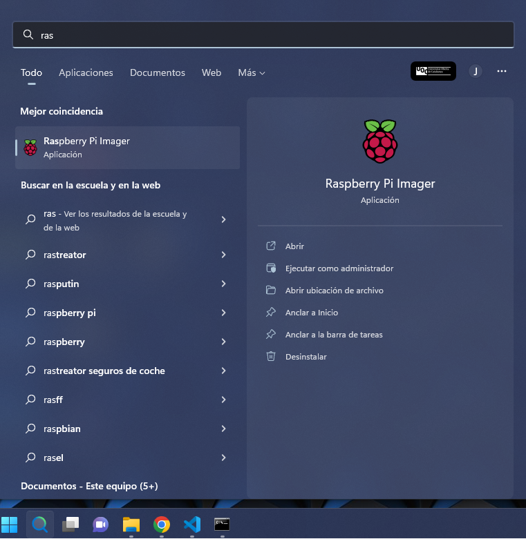
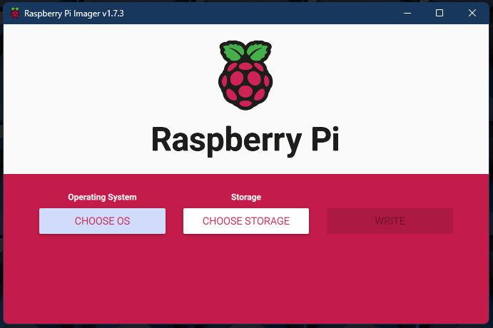
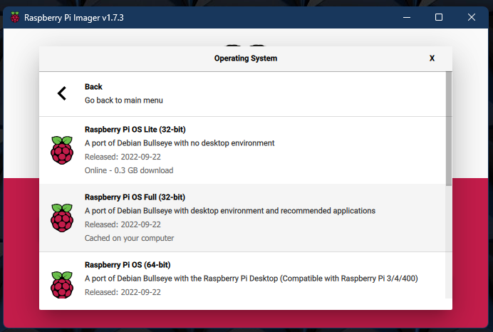
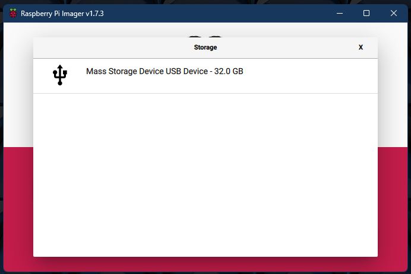
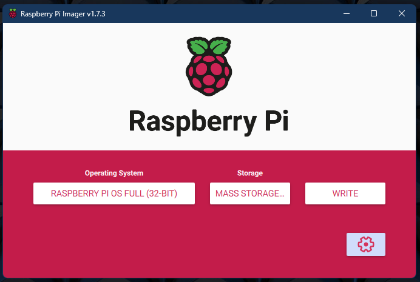
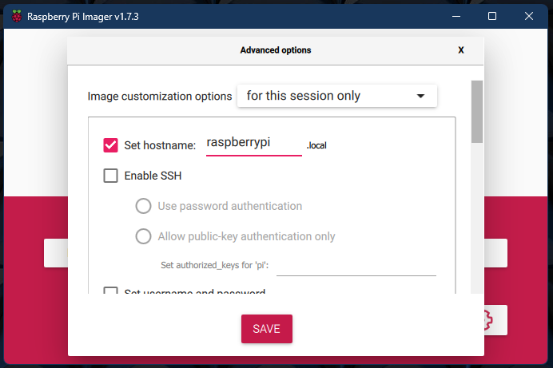
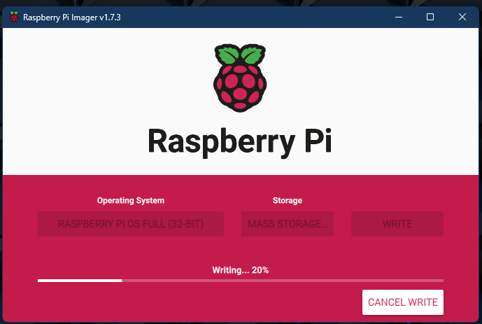

# Instalacion del Sistema operativo en la tarjeta SD

## Desde un Pc Windows

- Se procede a la instalacion de la aplicacion Raspberry Pi Imager
  - Se puede descargar la aplicación en la siguiente URL https://www.raspberrypi.com/software/.

- Se procede a su Instalación.

- Se procede a insertar la tarjeta Micro SD que se usará en la "Raspi" en el pc.

- Se procede a ejecutar Raspberry Pi Imager

- Aparecerá la pantalla de la aplicación.

- Seleccionamos ***CHOOSE OS*** $\rightarrow$ ***Raspberry Pi OS (other)*** $\rightarrow$ ***Raspberry Pi OS Full (32-bit)***.

- A continuacion nos devuelve a la pagina principal de la aplicacion con el SO seleccionado.

- Seleccionamos ***CHOOSE STOREAGE*** $\rightarrow$ ***Mass Storage Device USB Device - 32.0GB***

- Volverá a la pantalla principal con la unidad USB (donde se encuenta la tarjeta micro SD)

- Procedemos a hacer click en el engranaje.

- Procedemos a realizar las siguiente configuración:
  - Set Hosname.
  - Enable SSH.
    - Use Password authentication.
  - Set Username and password.
    - Escribimos User y password que tendrá la raspberry.
  - Configure wireless LAN:
    - Wireles LAN country $\rightarrow$ ES
  - Set locale setting:
    - Para Time Zone yo uso $\rightarrow$ Etc/UTC.
    - Para keyboard layout seleccionamos $\rightarrow$ es.
- Pulsamos el boton $\rightarrow$ SAVE.
- Pulsamos el boton $\rightarrow$ WRITE.

- Diremos que si a la advertencia ya que eliminaremos todos los datos de la tarjeta SD.

- Se procede a la instalacion de Raspbian en el dispositivo SD.

- Tras la instalación, la aplicación procede a comprobar la correcta instalación del SO en la tarjeta SD.

- La instalacion del SO en la SD habra finalizado.

- Se procede la configuracion para poder arrancar el dispositivo.
  - Se extrae la tarjeta SD del PC y se procede a su colocación  bvh  en la Raspberry.

- Se procede a conectar lo siguiente:
  - Entrada USB-C $\rightarrow$ fuente de alimentacion
  - USB 2.0 $\rightarrow$ Teclado y ratón (en nuestro caso es inalambrico y solo es necesario un puerto USB).
  - Micro-HDMI $\rightarrow$ monitor a traves de cable HDMI.

- Procedemos a su encendido.
